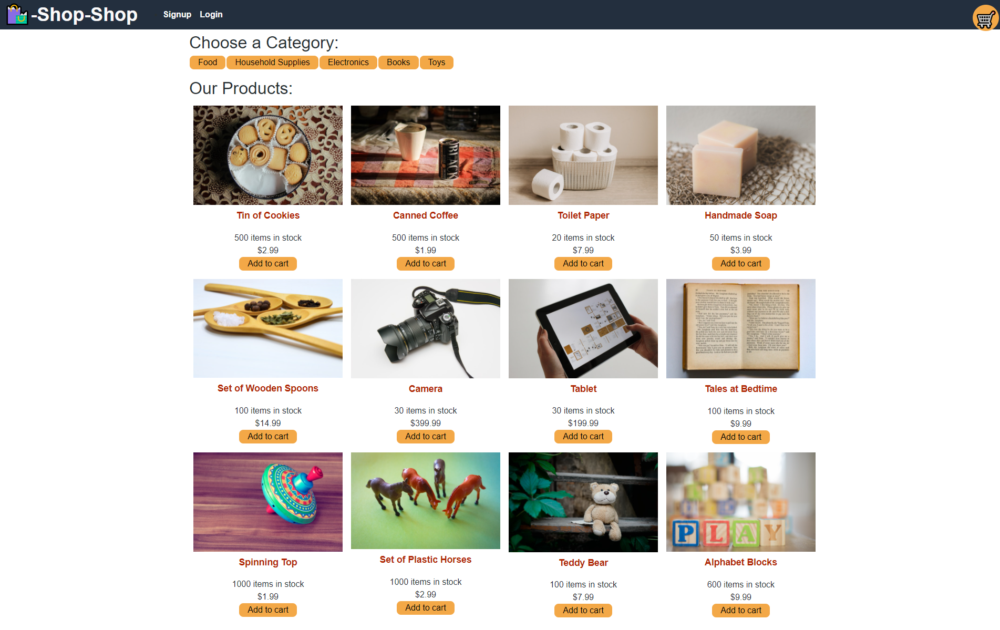
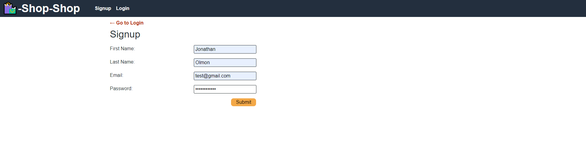
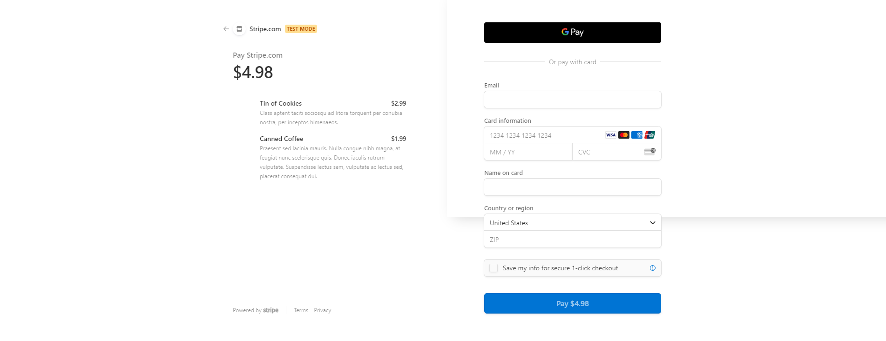

# Redux Store : E-Commerce Store

## Purpose

The purpose of this project was to convert an existing e-commerce application from using Context API to using Redux. 

Some features of the app are:

- When the user first loads the page they are able to view, search, and add products to their cart.
- When a user creates an account they are able to proceed to checking out with their account.
- Users are able to remove items from their carts. 
- Users are able to view their past orders.

The application can be found at: https://shielded-ravine-53453.herokuapp.com/

---

## Appearance

### Here is an example of the landing page on first visit:

### Here is an example of a user creating an account:

### Here is an example of a user viewing their cart to check out:

